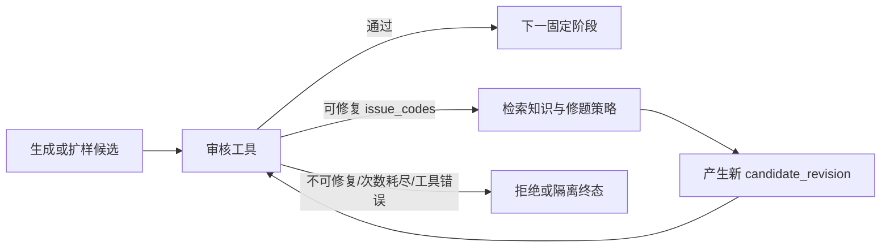
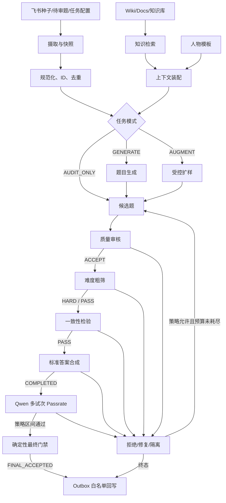

# 数据生成 Agent 产品需求文档（PRD）

文档版本：`0.1-draft`
更新时间：2026-07-11
项目：`data-generation-agent`
状态：架构与 Harness 规划阶段；完整生产流水线尚未启用

## 1. 执行摘要

本项目要构建一个无人值守的数据生成与题目审核 Agent。它从飞书多维表格读取种子题、任务配置和待处理记录，按需检索飞书知识库/文档及人物模板，完成四类业务任务：

1. 审核已有题目；
2. 审核题目难度；
3. 从种子、知识和人物模板生成新题；
4. 基于已有题目进行受控扩样。

所有候选题必须经过同一条可审计流水线：

```text
质量审核
→ GPT-5.5/Qwen 单次作答差距形成的难度粗筛
→ 一致性检验
→ 合成标准答案
→ Qwen 多次独立作答的 Passrate
→ 确定性最终门禁
→ 飞书白名单字段回写与数量对账
```

核心架构选择是“封闭工作流 + 局部 Agentic 修复”，而不是 Claude Code 式开放 Agent：

- 流水线顺序、工具、输入输出、预算和停止条件由版本化策略固定；
- 模型不能任意执行 Shell、修改项目文件或直接写飞书；
- Agentic 能力只存在于生成、扩样和有限次修题循环中；
- 所有不确定、缺失、超时或契约错误都自动拒绝或隔离，不等待人工；
- 只有确定性 `final_gate` 可以产生 `FINAL_ACCEPTED`。

项目的 Harness 不是附属测试脚本，而是产品本身的一部分。没有契约、离线测试、恢复测试、真实小样本、飞书读回对账和证据记录的模块，不得启用。

## 2. 背景与问题

当前已有资产包括：

- 飞书多维表格中的大量种子数据；
- 可提供的飞书知识库、文档和人物模板；
- `laokuoyang` 中已有的质量审核程序；
- GPT-5.5 与 Qwen 各作答一次、比较答案差距的旧难度程序；
- 后续用于一致性、答案合成和 Qwen Passrate 的已有或待提供程序；
- 可复用的模型网关和本地环境凭据。

现有脚本以批处理文件和 JSONL 为中心，缺少统一契约、可靠状态、权限边界、幂等回写和跨会话恢复。直接把它们暴露给一个开放 Agent 会带来以下问题：

- 单次答案差距被误当成 Passrate；
- 失败或缺字段被误判为“难题通过”；
- 相同 ID 的题目内容改变后复用旧结果；
- API 重试、进程中断或飞书失败导致重复调用、重复写入或统计漂移；
- 模型可以越权读写文件或修改不应修改的飞书字段；
- Prompt、模型、阈值和代码变化后无法重放或解释历史结果；
- 长任务跨上下文后依赖聊天记忆，新的 Agent 不知道真实完成度。

## 3. 产品目标与非目标

### 3.1 产品目标

- 无人工审核情况下，每个输入候选都进入唯一、明确、可追溯的终态。
- 支持 `AUDIT_ONLY`、`GENERATE`、`AUGMENT` 三种外部任务模式，并共享审核流水线。
- 支持 `REPAIR_ALLOWED` 策略：根据结构化审核反馈检索知识、修改题目并重新审核，但有严格次数和预算上限。
- 将质量、粗筛、一致性、答案合成、真实 Passrate 和最终门禁拆成独立工具，禁止语义混用。
- 使用稳定 ID、内容哈希、配置哈希和工具版本实现幂等、恢复与缓存失效。
- 对飞书只进行字段白名单、Outbox 驱动的幂等回写，并做读回对账。
- 按批次、任务类型、题型和阶段统计“剩余、通过、拒绝、隔离”数量。
- 为每个模块建立可执行的 Harness 启用门槛和可恢复开发记录。

### 3.2 成功指标

工程指标在首个生产版本中必须满足：

- 100% 输入 ID 获得一个且仅一个终态；
- 0 个失败候选进入下游阶段；
- 0 个单次粗筛分数被写成 Passrate；
- 同一幂等请求重放时，已完成模型调用的新增调用数为 0；
- 注入进程中断后恢复，最终 ID 集、业务结论和产物数与无中断运行一致；
- 飞书已确认写入的记录读回一致率为 100%；
- 日志、异常、产物和 Git 扫描中的真实密钥泄露为 0；
- 完整流水线任一必需模块未实现或未启用时，`FINAL_ACCEPTED` 数量为 0。

模型质量指标和 Passrate 目标区间必须按数据集策略配置，当前不在 PRD 中猜测固定数值。

### 3.3 非目标

- 不构建可任意编辑代码、安装软件或执行 Shell 的生产 Agent。
- 不允许模型直接操作飞书 Base、Wiki 或 Docs。
- 不在第一阶段重写所有旧审核算法；先以强类型适配器证明语义和等价性。
- 不把飞书当作唯一运行状态数据库或大体积原始产物存储。
- 不在一致性、答案合成、Passrate 工具尚未接入时声称完整 Agent 可用。
- 不把错误隔离队列解释成人工待办；无人模式下它是自动终态，不阻塞其他候选。

## 4. 用户场景与任务模式

### 4.1 `AUDIT_ONLY`

输入已有题目，只做审核，不允许模型修改原题。任何阶段拒绝即进入对应终态；工具错误进入隔离。

### 4.2 `GENERATE`

从种子数据、目标题型、人物模板和知识快照生成候选。候选进入完整审核链；可修复问题在预算内触发修题循环。

### 4.3 `AUGMENT`

基于父题扩样，必须声明允许改变和禁止改变的维度，例如行业、角色、参数、问法、难度或答案类型。扩样结果必须与父题建立谱系并通过去重和完整审核。

### 4.4 内部 `REPAIR`

不是独立外部任务，而是 `GENERATE`/`AUGMENT` 在策略允许时使用的内部动作。它只消费结构化 `issue_codes`、最新候选、必要知识和最近一次失败证据，不接收无限历史对话。

## 5. 关键架构决策

### 5.1 Agent 框架：封闭图，而不是开放式 Agent

推荐采用显式状态图。实现上可使用 LangGraph 的 `StateGraph` 和 checkpoint 能力，但业务事实源必须是项目自己的状态库和版本化契约，而不是框架内存。LangChain 的通用 ReAct Agent 不作为主控。

采用 LangGraph 时，它只负责：

- 根据状态和策略选择下一个已注册节点；
- 执行有限分支和有限修复循环；
- 在节点之间传递 ID 和结构化引用；
- 在进程重启后从 durable checkpoint 恢复。

它不能动态创建工具、改变阶段顺序、跳过门禁或决定新的飞书字段。

### 5.2 权限模型：能力白名单

生产运行时使用 capability-based 权限：

| 能力 | 默认 | 授权方式 |
|---|---|---|
| 读取候选运行目录 | 允许 | 仅当前 `run_id` 工作区 |
| 写运行产物 | 允许 | 仅不可变 artifact 路径和临时文件 |
| 任意项目文件编辑 | 禁止 | 仅开发 Agent 可在仓库工作区修改 |
| Shell | 禁止 | 工具适配器内部使用固定命令模板 |
| 网络 | 禁止 | 按工具 manifest 单独开启目标网关 |
| 飞书读取 | 最小授权 | Base/Wiki/Docs 只读工具 |
| 飞书写入 | 禁止给模型 | 独立 Outbox Worker + 字段白名单 |
| 密钥读取 | 禁止给模型 | 运行时 Secret Provider 注入进程内存 |

旧脚本通过隔离子进程运行。Agent 只能提交强类型请求，不能拼接命令行或指定任意脚本路径。

### 5.3 Agentic 能力边界

Agentic 能力是必要的，但只用于以下闭环：



每次修订产生新版本并使所有受影响的下游结果失效。模型不能修改历史结果，也不能把工具错误解释成通过。

### 5.4 状态库与产物库

- MVP：SQLite（单机）+ 本地不可变 artifact 目录；
- 生产：PostgreSQL + 对象存储；
- 飞书：任务入口和业务可见状态，不作为模型调用级 checkpoint；
- JSONL：保留旧工具原始产物，但不作为唯一事实源。

## 6. 端到端业务流程



### 6.1 固定阶段语义

| 顺序 | `stage_id` | 通过条件 | 失败处理 |
|---:|---|---|---|
| 10 | `quality_review` | `COMPLETED + ACCEPT` | `REJECT` 或工具错误隔离 |
| 20 | `difficulty_prescreen` | `decision=HARD + gate_decision=PASS` | `EASY` 为过易；错误隔离 |
| 30 | `consistency_review` | 版本化契约定义的 `PASS` | 不一致拒绝/修复；错误隔离 |
| 40 | `answer_synthesis` | `COMPLETED` 且答案契约有效 | 失败隔离，不得凭空补答案 |
| 50 | `qwen_passrate_review` | 有效试次数和区间满足数据集策略 | 过易/过难按策略拒绝或修复 |
| 60 | `final_gate` | 所有必需上游结果同版本、有效且通过 | 确定性拒绝；不调用模型 |

难度粗筛的旧程序只让 GPT-5.5 和 Qwen 各回答一次。客观题采用严格答案匹配，主观题按 Qwen 分数阈值判粗筛难度。该结果的 `passrate` 永远是 `null`。

## 7. 当前项目结构与真实完成度

### 7.1 仓库结构

```text
data-generation-agent/
├─ configs/
│  └─ question_pipeline.yaml       # 六阶段顺序与启用状态
├─ contracts/
│  ├─ question.schema.json
│  ├─ quality_review_result.schema.json
│  └─ difficulty_prescreen_result.schema.json
├─ docs/
│  └─ PRD.md
├─ src/data_generation_agent/tools/
│  ├─ common.py                    # ID、哈希、JSONL、子进程等公共能力
│  ├─ quality_review.py            # 质量审核适配器
│  ├─ difficulty_prescreen.py      # 规范入口
│  └─ legacy_gap_difficulty_review.py
├─ tools/*/tool.yaml               # 工具 manifest 与禁用占位符
├─ tests/                          # 离线测试和小样本 fixture
├─ feature_list.json               # 可恢复功能清单
├─ progress.md                     # 验证证据与交接日志
├─ README_AGENT.md                 # 后续 Agent 操作约束
└─ pyproject.toml
```

外部本地依赖 `../laokuoyang` 不复制进公开仓库，其中包含旧脚本和 Prompt。凭据保存在仓库外部环境文件中，只在进程内注入。

### 7.2 当前状态（2026-07-11）

| 模块 | 状态 | 证据/限制 |
|---|---|---|
| 质量审核适配器 | 已抽取、曾完成真实小样本 | 仍需进入总 Harness；旧 endpoint 为 HTTP，生产前需安全决策 |
| 难度粗筛适配器 | 新语义离线测试通过，暂时禁用 | 默认复用已验证网关；需完成新语义真实烟测、幂等和脱敏后启用 |
| 一致性检验 | 占位、禁用 | 等待现有程序及输入输出契约 |
| 答案合成 | 占位、禁用 | 等待现有程序及输入输出契约 |
| Qwen Passrate | 占位、禁用 | 试次数、评分规则和目标区间未配置 |
| 最终门禁 | 占位、禁用 | 必须等所有上游契约完成 |
| 生成/扩样/修复 | 未实现 | 需要知识、模板和策略契约 |
| 飞书摄取/回写 | 未实现 | 需要 Base 表、字段 ID 和测试表映射 |
| 持久状态 Harness | 仅有项目级文档骨架 | 尚无 runner、state store、outbox 和 tool registry |

当前 `full_pipeline_enabled: false`。任何执行器都必须在必需阶段为占位符时返回 `BLOCKED_NOT_IMPLEMENTED`，不能生成最终通过。

## 8. 数据、状态与记忆设计

### 8.1 核心标识

- `job_id`：一次用户任务；
- `batch_id`：一次批量处理；
- `seed_id`：飞书种子记录的稳定标识；
- `candidate_id`：候选题谱系标识；
- `revision_id`：候选题某一内容版本；
- `attempt_id`：某工具对某 revision 的一次执行；
- `trial_id`：Passrate 中一次独立 Qwen 试次；
- `result_id`：工具、输入哈希、Prompt/模型/策略/代码摘要共同生成的稳定结果 ID；
- `write_id`：飞书 Outbox 幂等写入 ID。

缓存和恢复不能只依赖 `candidate_id`。最小缓存键应包含：

```text
candidate_content_hash
+ tool_id/tool_version
+ prompt_digest
+ model_config_digest
+ policy_digest
+ relevant_knowledge_snapshot_digest
+ code_digest
```

### 8.2 四类记忆

1. **事实记忆**：种子、题目 revision、人物模板、知识快照、飞书字段快照；不可被模型覆盖。
2. **过程记忆**：阶段状态、尝试次数、错误、重试时间、预算、Outbox 状态；存入数据库。
3. **语义记忆**：知识库分块、Embedding/关键词索引和引用；按任务检索，不整库塞入 Prompt。
4. **经验记忆**：结构化 issue code、修复动作、前后 diff 和结果；用于策略统计，不保存成无边界聊天记录。

### 8.3 API Prompt 组成

每次模型 API 请求按固定顺序装配：

1. 不可变 System Policy：角色、权限、禁止项、无人模式 fail-closed 原则；
2. Stage Instruction：当前阶段唯一目标和评分/生成规则；
3. Dataset Policy：题型、难度目标、允许修改维度、预算和停止条件；
4. Candidate Snapshot：当前 revision，而不是所有旧版本全文；
5. Retrieved Context：与当前任务相关的知识片段、来源和快照 ID；
6. Upstream Evidence：上游结构化结论、答案或评分引用；
7. Repair Memory：最近一次失败、累计 issue code 和压缩后的已尝试动作；
8. Output Contract：严格 JSON Schema 与枚举；
9. Trace Metadata：不含密钥的 job/candidate/attempt/prompt 版本。

### 8.4 Prompt 如何演进

- 不把全部历史对话追加到 Prompt；每次基于 durable state 重建。
- 候选内容修改后递增 `revision_id`，旧 revision 和结果只读保留。
- 规则修改必须发布新的 `prompt_version` 或 `policy_version`，不能原地覆盖。
- 新 revision 从最早受影响的阶段重跑，下游结果标记 `STALE`。
- 修复循环只保留结构化摘要和最近必要证据；达到次数、Token、费用或时间任一上限即终止。
- GPT-5.5 与 Qwen 作答的默认 `max_tokens` 保持 32768；不同阶段若调整必须进入模型配置摘要。

## 9. 模块划分与详细计划

以下模块均采用五级推进：`契约 → 离线实现 → 集成/恢复 → 真实影子运行 → 启用`。任何一级缺失都不得跳级。

### M01. Job API 与任务策略

**目标**：把一次业务请求固化为版本化 `JobSpec`，决定模式、数据源、配额、题型、修复预算和写回目标。

**输入**：Base 任务记录或本地 Job JSON。
**输出**：不可变 `job_id`、`policy_digest`、批次分片和预算。
**核心规则**：所有可变业务选择必须显式进入 JobSpec；缺失必需策略时不启动。
**实施计划**：定义 Schema；实现校验与规范化；实现批次分片；加入取消、暂停和重放语义；最后接飞书任务入口。
**Harness DoD**：非法模式/空配额/未知字段拒绝；同一 JobSpec 产生同一 digest；策略变更产生新 job 版本；dry-run 零网络零写入。

### M02. 飞书 Base 摄取与源数据快照

**目标**：从允许的 Base、表和视图分页读取种子与待审题，形成可重放快照。

**输入**：`app_token/table_id/view_id`、字段映射、增量游标。
**输出**：规范化源记录、原始字段快照、`source_revision`、摄取对账报告。
**权限**：只读 token；不得在摄取模块写字段。
**实施计划**：先接测试 Base；实现分页、限流、重试和 schema discovery；固化字段 ID 映射；实现增量水位；保存输入快照 hash。
**Harness DoD**：分页不漏不重；字段缺失逐行报错；429/超时可恢复；同一水位重跑不重复创建候选；读入条数与 Base 读回条数一致。

### M03. 规范化、稳定 ID、谱系与去重

**目标**：把多来源记录变成统一 Candidate，并记录 seed/parent/revision 谱系。

**输入**：源快照、生成或扩样结果。
**输出**：`CandidateRevision`、内容 hash、重复簇、规范化题型。
**核心规则**：ID 与内容分离；同 ID 内容变化必须新建 revision；精确和语义去重都保留证据。
**实施计划**：Unicode/空白/选项规范化；稳定 hash；父子谱系；精确去重；再引入语义相似度和题型特定阈值。
**Harness DoD**：重复 ID、空题、选项损坏、编码异常覆盖；输入重排不改变 ID 集；同题微改产生新 revision；去重不直接删除原始记录。

### M04. 知识库快照与检索

**目标**：从 Wiki/Docs 或本地语料生成版本化知识快照，并为生成/修复/审核返回带引用片段。

**输入**：知识空间/文档 token、允许范围、解析策略。
**输出**：文档快照、chunk、索引、检索结果和 citation。
**核心规则**：检索结果必须可追溯到快照；知识更新不改变历史运行；权限沿用源文档最小范围。
**实施计划**：文档读取和快照；结构感知分块；关键词基线；再评估向量检索；实现领域、时效和来源过滤。
**Harness DoD**：固定查询召回固定金标片段；引用可反查；文档更新生成新 snapshot；越权文档不可见；空检索不允许模型伪造来源。

### M05. 人物模板与生成约束

**目标**：把人物、岗位、业务环境和题型要求转换为结构化模板，而不是自由文本 Prompt。

**输入**：用户模板、示例、允许变化维度。
**输出**：`PersonaTemplate`、约束 Schema、模板版本。
**实施计划**：定义必填字段；模板校验；示例引用；冲突检测；模板版本发布。
**Harness DoD**：缺必填字段、互斥约束、未知枚举拒绝；同模板渲染稳定；模板升级不污染历史 candidate；敏感字段不会写入公开产物。

### M06. 题目生成器

**目标**：基于种子、知识和人物模板生成满足题型和领域约束的候选题。

**输入**：JobSpec、seed、persona、retrieved context、生成配额。
**输出**：一个或多个带 provenance 的 CandidateRevision。
**核心规则**：生成器只能提出候选，不能宣布通过；必须输出依据、约束覆盖和来源引用。
**实施计划**：先支持单题单候选；加入结构化输出和 schema repair；再支持多候选、预算调度和多样性策略。
**Harness DoD**：100% 输出可解析或明确错误；每个候选有 seed/persona/knowledge 谱系；不复制受禁止内容；相同 idempotency key 不重复扣费；所有候选进入审核链。

### M07. 受控扩样器

**目标**：在保留父题关键能力的前提下生成可配置变体。

**输入**：父题 revision、变换策略、禁止改变项、知识/人物模板。
**输出**：子 CandidateRevision、变换说明、父子 diff。
**核心规则**：不得只做同义改写冒充新样本；不得意外改变答案类型或业务事实；每个子题独立审核。
**实施计划**：定义变换 taxonomy；实现单维度变换；加入组合变换和多样性控制；接去重与谱系。
**Harness DoD**：禁止维度保持；允许维度确实变化；父子引用完整；重复率满足策略；扩样失败不修改父题状态。

### M08. 质量审核与答案键预检

**目标**：判定题目是否成题、领域相关、条件完整、非开放且可验收，并在适用题型检查答案键/选项结构。

**当前实现**：已抽取 `lao_quality_review@1.0.0`，保留旧两阶段分类和专项审核语义；答案键预检尚未接入统一工具。
**输入**：CandidateRevision 及题型所需字段。
**输出**：`ACCEPT/REJECT/ERROR`、分类、结构化 issue codes、Prompt/模型摘要。
**实施计划**：冻结旧 adapter golden；增加答案键预检；统一错误终态为 quarantine；增加五类题型金标；接状态库缓存。
**Harness DoD**：五类 ACCEPT/REJECT 覆盖；Prompt 严格 YAML/JSON；score 与 decision 一致；旧 ANY-OF 聚合语义有回归测试；错误、冲突、缺结果不得 ACCEPT；真实小样本和日志脱敏通过。

### M09. GPT-5.5/Qwen 难度粗筛

**目标**：用一次 GPT-5.5 与一次 Qwen 作答差距快速过滤明显过易题，为昂贵的一致性和 Passrate 阶段节流。

**当前实现**：`lao_difficulty_prescreen@1.0.0` 已完成新契约离线验证，仍禁用等待新真实烟测。Qwen 暂时默认复用已验证 judge gateway，`--qwen-direct` 仅为显式 opt-out。
**输出语义**：

```text
HARD  → gate_decision=PASS → consistency_review
EASY  → gate_decision=REJECT_TOO_EASY
ERROR → gate_decision=QUARANTINE
passrate 永远为 null
```

**实施计划**：完成环境白名单和日志脱敏；真实默认路由烟测；重复运行 idempotency；启用 manifest；再接总状态图。
**Harness DoD**：客观 exact match/mismatch；主观 39/40 边界；缺分、越界、重复 ID、缺结果全部隔离；默认路由和 direct opt-out 测试；32k max tokens 保持；真实小样本无密钥泄露。

### M10. 一致性检验

**目标**：检查题面、选项、约束、证据、模型答案和预期答案是否内部一致。

**当前状态**：禁用占位符；需用户提供现有程序及其真实语义。
**输入**：只接受质量通过且粗筛通过的同一 revision；包含 GPT-5.5/Qwen 原始答案引用和必要知识。
**输出**：`PASS/FAIL/ERROR`、冲突位置、issue codes、可修复性。
**实施计划**：审计现有脚本；定义强类型 contract；建立冲突 fixture；做旧新等价 adapter；加入恢复与真实烟测。
**Harness DoD**：已知一致/不一致/证据缺失/答案冲突覆盖；缺任何必需输入 fail closed；不修改候选；每个输入一个终态；工具错误不得进入答案合成。

### M11. 标准答案合成

**目标**：在一致性通过后生成版本化、可引用、可评分的标准答案和解释。

**当前状态**：禁用占位符。
**输入**：CandidateRevision、一致性通过结果、知识引用和允许的模型证据。
**输出**：`ReferenceAnswerVersion`，含答案、解释、结构化评分点、引用、模型/Prompt 摘要。
**核心规则**：不覆盖题目；不能在缺证据或上游失败时合成；客观题需规范答案表示。
**实施计划**：审计现有合成程序；按题型定义 Schema；建立双模型/裁决策略；输出 canonical answer；与 Passrate scorer 对接。
**Harness DoD**：答案可解析、引用可反查、题型 Schema 有效；同输入重跑 result ID 稳定；模型分歧有明确错误或裁决；错误不得产生空壳答案。

### M12. Qwen 多试次 Passrate

**目标**：对合成标准答案运行多次独立 Qwen 作答与评分，计算真实通过率和有效性统计。

**当前状态**：禁用占位符；不得复用粗筛分数。
**输入**：题目 revision、ReferenceAnswerVersion、trial policy、Qwen/评分器版本。
**输出**：每 trial 原始结果，以及 `requested/completed/valid/passed/passrate/uncertainty` 汇总。
**核心规则**：每次 trial 独立；空响应/无效评分不计为通过；有效试次不足时结果无效；GPT-5.5 和 Qwen 生成保留 32k max tokens。
**实施计划**：接入用户现有 Passrate 程序；定义 trial ID 和恢复；实现并发上限；接 DeepSeek 评分器；配置数据集区间。
**Harness DoD**：中断后只补未完成 trial；无重复 trial；汇总可由明细重算；空/非法 Qwen 或 GT 有诊断；目标区间为 null 时拒绝启用；真实小批次费用和延迟受控。

### M13. Agentic 修题控制器

**目标**：把审核反馈变成有限、可追踪的修复动作。

**输入**：当前 revision、结构化 issue codes、相关知识、repair policy。
**输出**：新 revision、修改理由、diff、消耗预算，或 `REPAIR_EXHAUSTED`。
**路由示例**：`TOO_EASY` 进入难度增强；`MISSING_REQUIRED_CONTEXT` 补充约束；`INCONSISTENT_QUESTION` 重新校正题面/选项；工具错误禁止修题。
**实施计划**：issue→action 映射；一次修复；循环预算；重复失败检测；策略统计。
**Harness DoD**：最大尝试严格生效；相同错误无进展时提前终止；每次 revision 触发正确的下游失效；AUDIT_ONLY 永不修改题；错误不会被 Prompt 诱导成通过。

### M14. 确定性最终门禁

**目标**：不调用模型，只按版本化策略汇总上游状态并产生唯一最终结果。

**输入**：同一 revision 的完整阶段结果和 dataset policy。
**输出**：`FINAL_ACCEPTED` 或明确终态原因。
**核心规则**：所有结果必须同 revision、同 policy lineage；任何缺失、STALE、ERROR 或禁用阶段都拒绝。
**实施计划**：定义终态枚举；实现纯函数 policy evaluator；加入完整路径测试；最后启用。
**Harness DoD**：真值表全覆盖；无网络；重复执行字节级业务结论一致；只有该模块能输出 `FINAL_ACCEPTED`；占位阶段存在时接受数为 0。

### M15. Durable State、Artifact Store 与恢复

**目标**：使长任务跨进程、跨上下文和跨机器恢复，不依赖聊天历史。

**输入/输出**：Job、Candidate、Revision、Attempt、Trial、Artifact、Event、Outbox 的持久记录。
**实施计划**：SQLite Schema 和迁移；事务状态转换；不可变 artifact 命名；lease/heartbeat；Postgres 适配。
**Harness DoD**：每阶段前后强杀恢复；部分文件/坏尾行检测；状态与产物原子提交或可修复；输入/Prompt/模型/策略变化使缓存失效；并发 worker 不重复领取。

### M16. 飞书回写、Outbox 与数量统计

**目标**：把业务结果安全写入对应表格字段，并维护每种题型各流程剩余量。

**输入**：已提交的终态事件、字段 allowlist、Base 映射。
**输出**：Outbox 记录、写入回执、读回对账、阶段计数快照。
**建议字段**：`candidate_id/batch_id/mode/question_type/current_stage/stage_status/quality_decision/prescreen_decision/consistency_decision/answer_version/passrate/valid_trials/final_decision/issue_codes/repair_attempts/result_id/updated_at`。
**统计维度**：按 batch、任务模式、题型、阶段计算 `pending/passed/rejected/quarantined`。
**核心规则**：模型不直接写飞书；只允许字段 ID 白名单；计数来自状态库事件投影，不靠模型计算；回写失败只重试 Outbox，不重跑审核。
**Harness DoD**：测试 Base 写入和读回 100% 一致；重复 write_id 不产生重复；字段越权拒绝；部分失败可续传；计数可从事件全量重建且与 Base 一致。

### M17. 工具注册、模型网关与 Secret Provider

**目标**：只向 Orchestrator 暴露已验证、已启用、版本匹配的工具。

**输入**：`tool.yaml`、Schema、允许脚本 hash、模型路由、外部 Secret Provider。
**输出**：只读工具目录、健康状态和路由摘要。
**核心规则**：manifest `enabled:false` 必须在运行时强制阻止调用；密钥值不进入 Prompt、日志、状态库或 Git；Qwen 临时默认路由仅在内存中建立别名。
**实施计划**：manifest loader；Schema/命令一致性校验；固定命令模板；环境变量白名单；路由健康检查；密钥轮换。
**Harness DoD**：禁用工具不可调用；未知参数拒绝；缺 secret fail closed；子进程仅收到允许变量；stdout/stderr/异常脱敏；脚本 hash 漂移触发重新验证。

### M18. 可观测性、预算与运营

**目标**：让无人流水线可以发现停滞、成本异常、模型漂移和数据漏斗变化。

**指标**：每阶段吞吐、延迟、错误率、重试率、Token/费用、修复次数、接受率、隔离率、Passrate 分布、Base backlog。
**日志**：结构化 event，包含 ID 和版本摘要，不含题目敏感全文或密钥。
**实施计划**：event schema；本地 JSON/SQLite 指标；告警规则；批次报告；生产监控。
**Harness DoD**：每个 attempt 有 started/finished/usage/error_kind；停滞和 wall timeout 可触发；密钥扫描为 0；费用上限触发后不再提交新模型请求。

### M19. Harness Runner 与开发交接

**目标**：把上述验证门禁自动化，并让后续 Agent 从仓库文件恢复工作。

**核心资产**：`feature_list.json`、`progress.md`、`README_AGENT.md`、初始化脚本、fixture/golden、验证命令和稳定 Git checkpoint。
**实施计划**：增加 `init.ps1`；实现 manifest preflight；统一测试命令；生成验证报告；把真实烟测证据与代码版本绑定。
**Harness DoD**：新上下文只读仓库即可回答目标、当前状态、下一项和验证命令；功能只有在证据存在时标 `done`；失败测试和阻塞明确记录。

## 10. Harness 验证标准

### 10.1 验证层级

| 层级 | 名称 | 目的 | 是否用真实外部系统 |
|---:|---|---|---|
| H0 | 静态/契约 | Schema、manifest、Prompt、配置和权限声明有效 | 否 |
| H1 | 单元测试 | 纯函数、边界、映射、哈希和策略真值表 | 否 |
| H2 | Mock 集成 | 模拟 OpenAI 兼容 API、飞书 API 和错误 | 否 |
| H3 | Legacy 等价 | 旧 CLI 与新 Adapter 对同 fixture 业务结果等价 | 本地旧程序 |
| H4 | 恢复/Chaos | 强杀、超时、坏产物、重复任务和并发竞争 | 否或 Mock |
| H5 | 真实 API 烟测 | 最小样本验证路由、Schema、费用和脱敏 | 是，受限 |
| H6 | 飞书影子 | 测试 Base 写入、读回和对账，不影响生产表 | 是，测试表 |
| H7 | Canary | 小批次真实业务，严格预算和自动停止 | 是 |
| H8 | 生产启用 | 达到发布门禁后逐模块开启 | 是 |

### 10.2 所有模块的统一硬门槛

1. 输入、输出和错误均有版本化 Schema；
2. 所有输入 ID 都有一个终态，且接受/拒绝/隔离集合互斥；
3. 错误、缺字段、超时、无效模型响应一律 fail closed；
4. 幂等键覆盖内容、工具、Prompt、模型、策略和知识版本；
5. 中断恢复不重复已确认的外部副作用；
6. 原始模型响应、规范结果和 provenance 均可追溯；
7. 预算、并发、请求 timeout、无进展 timeout 和 wall timeout 均有上限；
8. 日志、异常、缓存、产物和 Git 的 secret scan 为 0；
9. manifest 在验证完成前为 `enabled:false`；
10. 验证命令和结果写入 `progress.md`，对应 feature 才能标 `done`。

### 10.3 必测故障矩阵

- API：429、500、超时、连接中断、空响应、畸形 JSON、Schema 漏字段、分数越界；
- 数据：空题、重复 ID、同 ID 内容变更、超长题、编码异常、选项/答案不一致；
- 进程：模型响应后落盘前强杀、状态提交后视图生成前强杀、worker lease 过期；
- 文件：JSONL 坏尾行、缺失 artifact、摘要与明细不一致；
- 并发：相同 candidate 重复投递、相同 trial 并发领取、Outbox 重复消费；
- 配置：Prompt、模型、阈值、知识快照、代码 hash 变化；
- 权限：越界路径、未知命令参数、禁用工具调用、非白名单飞书字段；
- 预算：Token、费用、修复次数、trial 数和 wall time 耗尽。

### 10.4 发布门禁

单工具启用需同时满足：

```text
H0/H1/H2 全绿
+ 如有旧程序则 H3 等价
+ H4 恢复/幂等全绿
+ H5 最小真实烟测全绿
+ secret scan 为 0
+ progress.md 有证据
→ tool manifest enabled=true
```

完整流水线启用还需：

```text
所有必需工具 enabled=true
+ Passrate policy 的试次数、有效下限和目标区间非 null
+ final_gate 真值表全绿
+ H6 飞书读回对账全绿
+ H7 Canary 无阻断错误
→ full_pipeline_enabled=true
```

### 10.5 质量回归策略

模型输出非完全确定，因此回归分两类：

- **确定性不变量**：Schema、ID、路由、集合互斥、阈值映射、计数、权限和恢复必须 100% 一致；
- **语义金标**：固定代表性题集记录可接受区间、必拒样本和理由类别。Prompt/模型升级先影子运行，比较漏斗和 issue code 漂移，再发布新版本。

### 10.6 语义基准的初始建议

以下是进入正式生产前的初始建议，不替代数据负责人最终确认的数据集目标：

- 质量审核每种题型至少建立 50 条冻结金标，明显红线题的拒绝召回率必须为 100%；
- 质量审核的 ACCEPT precision 建议不低于 95%，单类 F1 建议不低于 85%；
- 生成和扩样的完全重复率必须为 0，近重复率目标建议低于 2%；
- 每个 Passrate 结果必须报告有效 trial 数和统计不确定性，有效数不足不得输出难度通过；
- 新 Prompt/模型相对已发布版本的关键质量指标回退超过 2 个百分点时不得直接升级；
- 所有比例阈值按题型和 DatasetPolicy 分开配置，不能用一个全局值覆盖所有数据。

核心状态机、最终门禁、计数、权限和发布逻辑的分支覆盖应达到 100%；其他核心模块目标不低于 90%。离线测试默认禁止真实网络，并应连续运行验证无随机失败。

### 10.7 结构化发布证据与回滚

`progress.md` 是交接日志，不是唯一发布凭证。每次启用工具或完整流水线必须生成机器可校验的 `release-evidence.json`，至少绑定：

```text
Git commit / dirty-state declaration
tool, schema, Prompt, model, policy and code digests
knowledge/persona snapshot versions
offline, recovery, real-smoke and Feishu reconciliation run IDs
coverage and semantic benchmark summaries
secret/dependency scan result digests
previous stable version and rollback command
```

代码、Prompt、Schema、模型/endpoint、路由、知识检索、飞书字段映射或阈值任一变化，旧发布证据自动失效。

回滚不删除历史数据：先停止领取新任务和 Outbox，再切回上一已验证版本，将受影响 release 标记为 `WITHDRAWN`，重排未发布任务，最后对 Agent 所拥有的飞书字段执行受控补偿并完成全量对账。生产前必须在测试环境演练“请求成功但 ACK 丢失”“已回写后版本回滚”等场景。

Harness 的一致性目标是：计算步骤允许至少执行一次，但逻辑业务结果和外部副作用必须恰好生效一次。

## 11. 开发里程碑

### P0. 事实源与安全底座

交付：PRD、feature list、progress、Agent 说明、工具 manifest loader、环境白名单、日志脱敏、`init.ps1`。
退出条件：新 Agent 可恢复；禁用工具无法调用；全部离线测试通过。

### P1. 审核型 MVP

交付：Base 只读摄取、规范化、质量审核、难度粗筛、状态库、测试表回写。
限制：没有一致性/答案/Passrate 时只能输出阶段结论，不能 `FINAL_ACCEPTED`。
退出条件：小批次 audit-only 端到端可恢复、可对账。

### P2. 完整评估链

交付：一致性、答案合成、真实 Qwen Passrate、确定性最终门禁。
退出条件：完整六阶段离线、真实 API 和飞书影子测试全绿。

### P3. 生成、扩样与修复

交付：知识快照、人物模板、生成器、扩样器、有限修题循环。
退出条件：生成/扩样样本全部走相同门禁；修订谱系和缓存失效正确。

### P4. Canary 与生产化

交付：PostgreSQL/对象存储、调度、监控、费用告警、生产 Base 字段映射。
退出条件：Canary 在预算内稳定运行，读回对账 100%，可安全停止和恢复。

## 12. 风险与缓解

| 风险 | 影响 | 缓解 |
|---|---|---|
| 旧脚本语义被误命名 | 错误门禁 | 独立 tool ID、Schema、`passrate:null` 和 golden 测试 |
| 模型不稳定 | 结论漂移 | 版本化 Prompt/模型、语义金标、影子升级 |
| 无人工导致模糊样本悬空 | 队列阻塞 | 自动拒绝或隔离终态，永不等待人工 |
| 修题无限循环 | 成本失控 | 次数/Token/费用/时间四重预算与无进展检测 |
| 旧结果串题 | 错误复用 | 内容 hash + 配置/代码摘要；revision 失效传播 |
| 飞书回写重复/错字段 | 数据污染 | Outbox、write_id、字段 ID 白名单、读回对账 |
| 密钥泄露 | 安全事故 | Secret Provider、环境白名单、日志脱敏和扫描 |
| HTTP 内部网关 | 凭据传输风险 | 明确信任边界；生产优先 HTTPS/mTLS 或受控私网 |
| 外部依赖缺失 | 公共仓库不可复现 | 明确 vendor/fixture 策略；外部脚本 hash preflight |
| Passrate 策略未定 | 无法最终判定 | 配置保持 null 并阻止启用，不由 Agent 猜测 |

## 13. 待用户提供或确认

以下事项不会阻止 PRD 和基础 Harness 开发，但会阻止对应模块启用：

1. 一致性检验程序、调用方式、输入样例和预期输出；
2. 标准答案合成程序、题型差异和可信来源规则；
3. Qwen Passrate 程序、trial 数、评分器策略、最小有效试次和各数据集目标区间；
4. 飞书测试 Base 链接、表/字段映射，以及各题型统计应写入的目标表；
5. 知识库/Wiki/Docs 的允许范围和快照更新策略；
6. 人物模板示例、必填字段和允许扩样维度；
7. 每种任务的数量配额、费用上限、并发和最大修复次数；
8. 生产环境是否允许继续使用 HTTP 内部网关，或需要 HTTPS/mTLS。

## 14. 终态与计数定义

建议统一终态：

- `FINAL_ACCEPTED`
- `REJECTED_QUALITY`
- `REJECTED_TOO_EASY`
- `REJECTED_INCONSISTENT`
- `REJECTED_PASSRATE_TOO_HIGH`
- `REJECTED_PASSRATE_TOO_LOW`
- `REPAIR_EXHAUSTED`
- `QUARANTINED_TOOL_ERROR`
- `QUARANTINED_INVALID_DATA`
- `BLOCKED_NOT_IMPLEMENTED`
- `CANCELLED_BUDGET`

“还剩多少”必须由状态事件投影计算：

```text
remaining(stage, type, batch)
= eligible_input_count
- terminal_pass_count
- terminal_reject_count
- terminal_quarantine_count
```

运行中、等待重试和等待 Outbox 写回应分别计数，避免把“审核完成但飞书未写回”误认为“尚未审核”。

## 15. Long-running Agent 交接契约

每个开发会话开始时必须：

1. 读取本 PRD、`feature_list.json`、`progress.md`、`README_AGENT.md` 和 `configs/question_pipeline.yaml`；
2. 运行或检查初始化与当前测试状态；
3. 只选择一个未阻塞 feature 标为 `in_progress`；
4. 实现、验证并记录证据；
5. 只有满足 acceptance 和 verification 后才标 `done`；
6. 结束前记录 changed files、验证命令、阻塞和下一项。

如果 Agent 对当前状态产生歧义，应先修正 Harness 事实源，再继续写业务代码。
